# Fast Way to Setup an ERP(IT) System For the Critical Infra Cyber Range [ Land Based Railway System ]

**us English** | [cn 中文](1_Fast_Setup_IT_ERP_System_CN.md)

**Project Design Purpose** : For the cyber range/twin (such as Power Grid, Airport Runway, Traffic Lights) used in the attack and defense cyber exercise, most of time the Red/Blue/Yellow Teams focus more on the Operational Technology (OT) system, but some times there are also requirements for building a simple company IT system (such as the internal ERP & HR service) to simulate the attack initial access through weaknesses in the corporate IT network before pivoting into OT networks such as  IT-to-OT attack chains, credential compromise, lateral movement, and exploitation of misconfigured enterprise services.

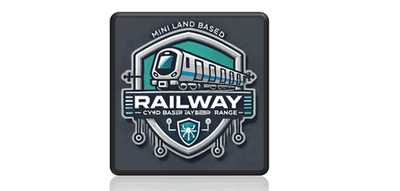

As shown in the 6 layers (level0-5) of ISA-95/IEC62264 system architecture, the IT layer (level4-5) represents the corporate network where business operations are managed. This project aims to provide a fast and practical approach to build such an ERP-based IT environment for OT cyber twin system in several hours by using the opensource DOLIBARR ERP & CRM package for the Land Based Railway Cyber Range System. This article is structured into three main sections:

- **System Architecture**: Introduces the overall cyber range architecture, cyber exercise network topology and explains the role and positioning of the ERP system within the railway environment.
- **ERP Software Setup**: Provides step-by-step instructions to install and deploy the Dolibarr ERP package within the cyber range, including integration with other system components.
- **ERP Function Configuration**: The step to configure main function features such as HR management, leave application, collaboration workflows, and payroll. Then use AI to create some information so the ERP system looks similar as a real one.

**Acknowledgement**: The ERP system used in this project is built with the unmodified version of Dolibarr ERP & CRM. All usage strictly follows the licensing terms and branding guidelines defined by the  [DOLIBARR License Doc]( https://wiki.dolibarr.org/index.php/FAQ_What_is_Dolibarr_licence_%3F) and [DOLIBARR Copy Right Rules](https://wiki.dolibarr.org/index.php/Rules_to_use_the_brand_name_%22Dolibarr%22). 

```python
# Author:      Yuancheng Liu
# Created:     2026/03/16
# Version:     v_0.0.1
# License:     GNU/GPL v3+ (Same as the DOLIBARR license)
```

**Table of Contents**

[TOC]

- [Fast Way to Setup an ERP(IT) System For the Critical Infra Cyber Range [ Land Based Railway System ]](#fast-way-to-setup-an-erp-it--system-for-the-critical-infra-cyber-range---land-based-railway-system--)
    + [1. Introduction](#1-introduction)
      - [1.1 Abstract](#11-abstract)
      - [1.2 Background Information](#12-background-information)
    + [2. System Architecture](#2-system-architecture)
      - [2.1 Architecture and Functions Overview](#21-architecture-and-functions-overview)
      - [2.2 System Network Configuration](#22-system-network-configuration)
    + [3. Install Dolibarr on Ubuntu VMs](#3-install-dolibarr-on-ubuntu-vms)
    + [4. Configure the Dolibarr Function Models](#4-configure-the-dolibarr-function-models)
      - [4.1 Configure Company Information](#41-configure-company-information)
      - [4.2 Configure Human Resource (HR) Modules](#42-configure-human-resource--hr--modules)
      - [4.3 Configure Customer Relationship Management (CRM)](#43-configure-customer-relationship-management--crm-)
      - [4.4 Configure Financial Modules](#44-configure-financial-modules)
      - [4.5 Configure Multi-Module Tools and Integration](#45-configure-multi-module-tools-and-integration)
      - [4.6 Configure Advanced / Custom Modules](#46-configure-advanced---custom-modules)

------

### 1. Introduction

The objective of this project is to integrate a Enterprise Resource Planning (ERP) system into the enterprise IT layer of the Land Based Railway Cyber Range System to simulate the real-world corporate operations alongside industrial compnay. The open-source Dolibarr ERP & CRM platform will be setup in the level4 enterprise IT layer of the railway system's ISA-95 architecture, then the platform is able to simulate essential business functions for a railway company—such as human resources, finance, and internal administration. In particular, it allows simulation of real-world attack paths where adversaries initially compromise enterprise IT systems before pivoting into operational networks.

The overall system architecture, including the positioning of the ERP system within the cyber range is shown below :

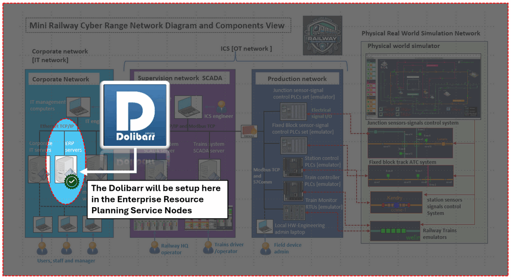

#### 1.1 Abstract 

In the modern cyber range and cyber twin environments for critical infrastructure—such as power grids, airports, and railway systems—cybersecurity exercises have normally focused on Operational Technology (OT) industrial control system such as SCADA networks and OT field devices. But in many real-world cyber incidents, as the OT environment is isolated from the internet, the attackers often need to gain initial access through some vulnerabilities or misconfiguration in the corporate IT environment then can touch the OT systems. So have a IT system between the company outside network and OT network is necessary for a cyber range used for cyber exercise.

From a system design view, most enterprise IT environments across different industries and companies are very similar. The core systems such as HR, finance, and administrative platforms follow standardized workflows regardless of whether the organization operates in energy, transportation, or manufacturing. Unlike building the related OT systems, which requires deep domain-specific knowledge, the IT systems implemented by using the generalized solutions without sacrificing realism can almost full fill the requirement of cyber exercise. That's why I use the opensource ERP(enterprise resource planning) software Dolibarr to build the IT environment directly. And this approach enables rapid deployment of a functional and realistic enterprise environment, supporting integrated IT/OT cybersecurity scenarios without the need for extensive customization or development effort.

#### 1.2 Background Information

**1.2.1 Background of the Land-Based Railway Cyber Range System**

The Land-Based Railway IT/OT Cyber Security Test Platform is a cyber twin-style design and developed under the ISA-95/IEC62264 standard, purpose-built for cybersecurity research, red-blue team exercises, professional training, threat detection, and honeypot experimentation. The system is designed to emulate both IT and OT environments of a railway company, while also enabling the visualization of cyber attack impacts in a controlled setting.

The cyber range is able to simulate realistic operational scenarios, including automated generation of human-like activities within the system. This dynamic behavior significantly enhances the fidelity of the cyber range, making it closely resemble a live railway enterprise environment. The platform has been utilized in multiple international cybersecurity exercises. For more detailed information, refer to the project documentation repository: https://github.com/LiuYuancheng/Land_Based_Railway_Simulation_Cyber_Range_Document

**1.2.2 Background of the Dolibarr ERP & CRM Software**

Dolibarr ERP & CRM is a modern and modular open-source ERP and CRM solution designed to manage a wide range of organizational activities, including contacts, invoicing, orders, inventory, scheduling, and human resources.

Developed primarily in PHP with JavaScript enhancements, Dolibarr is suitable for organizations of various sizes—from small businesses to large enterprises, as well as foundations and freelancers. Its modular architecture, ease of deployment, and active open-source community make it an ideal choice for rapidly building a realistic enterprise IT environment within a cyber range. For more details, refer to the official repository: https://github.com/Dolibarr/dolibarr


------

### 2. System Architecture

#### 2.1 Architecture and Functions Overview

The Land-Based Railway Cyber Range System is designed in accordance with the ISA-95 / IEC 62264 architecture as shown below six layers ISA-95 structure diagram. Within this architecture, the Dolibarr ERP & CRM system is deployed in the Level 4 Enterprise Zone, where it serves as the company internal platform for business operations included the services to staff such as human resources management, administrative workflows, and financial operations. And the cyber exercise can configure different vulnerabilities and attack entry points that may propagate to lower OT layers. 

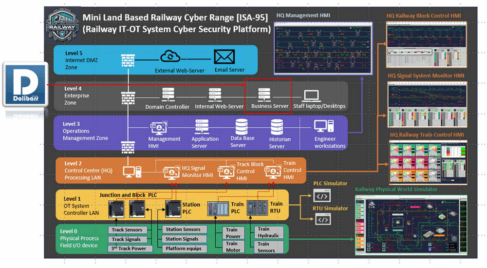

To enhance realism, the cyber range incorporates automated user behavior through the Cluster User Simulator (script-based engine). These simulation scripts generate dynamic and continuous activities across the IT network, mimicking the daily operations of various railway company roles such IT-Support-Engineer, Officer Staff, Railway HQ operator, Train driver / safety checker. The main components of this architecture include:

- **Railway Corporate Network Environment**: A virtualized infrastructure that replicates enterprise-grade network elements, including servers, endpoints, firewalls, routers, and switches.
- **Railway Company Staff ERP System**: The ERP software with the front end application and back end data base provide the main function of HRM, customer relationship, financial, ticketing and company event.
- **Staff Activity Simulation Engine**: An automated user activity generator that emulates realistic user behavior, producing network traffic and system interactions across different roles.

#### 2.2 System Network Configuration 

As shown in Section 1 (Figure 1), the Dolibarr ERP & CRM system is deployed within the corporate IT subnet (Level 4 – Enterprise Zone) of the cyber range, highlighted as the light-blue segment in the architecture. Although Dolibarr recommends deploying all components on a single server (or cloud instance) to simplify management and improve stability, this project intentionally adopts a distributed three VM (one application front end VM, one database backend VM and one File storage VM) architecture so it can be easily attacked during the cyber exercise with below attack vector:

- Web application attacks targeting the front-end server
- Database exploitation and data exfiltration scenarios
- Credential harvesting and lateral movement between VMs
- Misconfigured file services and insecure data transfer channels

The detailed network configuration is illustrated below:

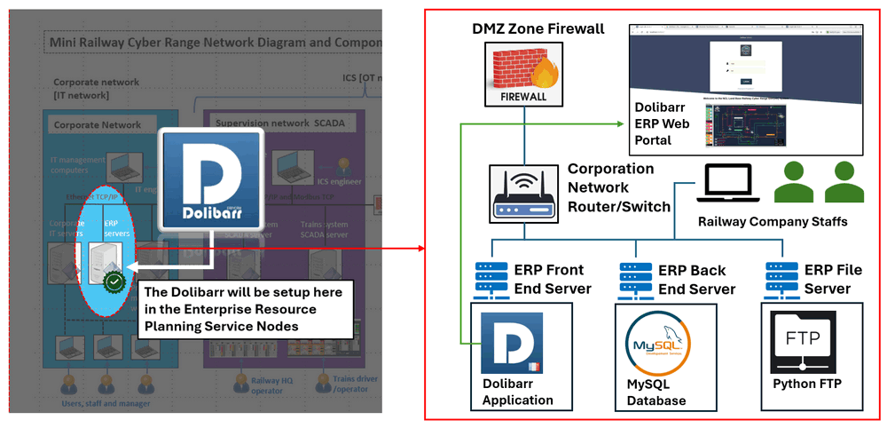

The main function of each VM includes:

- **ERP Front-End Server** : This VM hosts the Dolibarr application and web interface, providing access to all ERP functional modules (HR, finance, administration, etc.). It acts as the primary entry point for users via the internal network or web portal.

- **ERP Back-End Server (Database Server)** : This VM runs the database service using MySQL, which stores all ERP-related data, including user information, transactions, and system configurations. Separating the database from the application layer reflects common enterprise practices and enables database-focused attack scenarios.
- **ERP File Server** : This VM is responsible for file storage and handling user-uploaded content. As the native Dolibarr FTP module is not freely available, a lightweight Python-based FTP service is used.

All three VMs are connected through the corporate network router/switch, allowing internal railway staff to access ERP services seamlessly. The network is further protected and segmented by a DMZ firewall, which controls traffic between the internal network and external access points such as the ERP web portal. For the email server we use a Postfix email server also set inside the subnet. And as Dolicarr recommends Gmail, so currently for the Dolicarr's staff account I use the normal Gmail account. 

------

### 3. Install Dolibarr on Ubuntu VMs

To install the Dolibarr on Ubuntu System, the official web provides the installation `*.deb` package in the download link : https://www.dolibarr.org/downloads.php. But when you download and install it, you may see the "Connect to database failed" error after the step1 of the post install as shown below:

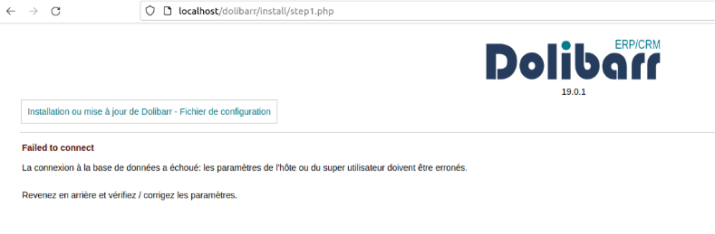

This section provides a structured approach to installing and configuring Dolibarr across multiple VMs (front-end, database, and file server), along with troubleshooting steps to resolve this issue.

**3.1 Install LAMP Stack (Front-End VM)**

Before installing Dolibarr, ensure the front-end VM has a complete LAMP stack (Apache, PHP, and database client libraries):

```bash
sudo apt update
sudo apt install apache2 mariadb-server php libapache2-mod-php php-mysql php-curl php-intl php-gd php-json php-mbstring -y
```

**3.2 Download and Install Dolibarr**

Download the latest `.deb` package from the sourceforge website: https://sourceforge.net/projects/dolibarr/files/Dolibarr%20installer%20for%20Debian-Ubuntu%20%28DoliDeb%29/, then Install the package using:

```bash
sudo dpkg -i dolibarr_x.y.z-w.w_all.deb
```

If dependency issues occur, resolve them with:

```bash
sudo apt-get install -f
```

**3.3 Configure Database Server (Back-End VM)**

On the database VM, install and secure MySQL (or MariaDB):

```bash
sudo mysql_secure_installation
```

Log in to the database:

```bash
sudo mysql -u root -p
```

Create the Dolibarr database and user:

```mysql
CREATE DATABASE dolibarr;
CREATE USER 'dolibarruser'@'%' IDENTIFIED BY 'your_password';
GRANT ALL PRIVILEGES ON dolibarr.* TO 'dolibarruser'@'%';
FLUSH PRIVILEGES;
EXIT;
```

Use `'%'` instead of `'localhost'` to allow remote connections from the front-end VM.

Ensure the database server is configured to accept remote connections by editing  `/etc/mysql/mariadb.conf.d/50-server.cnf` and setting:

```bash
bind-address = 0.0.0.0
```

Restart the database service `sudo systemctl restart mysql` and  ensure port 3306 is open between VMs (firewall/security group).

**3.4 Configure Dolibarr to Use Remote Database**

By default, Dolibarr assumes the database is hosted locally. In a multi-VM setup, you must manually update the configuration. Edit the Dolibarr configuration file on the front-end VM:

```bash
sudo vim /etc/dolibarr/conf.php
```

Locate the database host setting and replace `localhost` with the **IP address of the database VM**, as shown below:

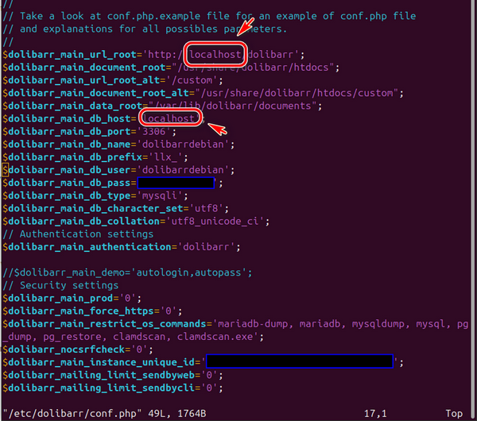

**3.5 Complete Installation via Web Interface**

Once configuration is complete, open a browser and navigate to `http://localhost/dolibarr` or `http://<frontend_vm_ip>/dolibarr`, redo the step1 to fill in the information then you will see the error will be cleared as shown below:

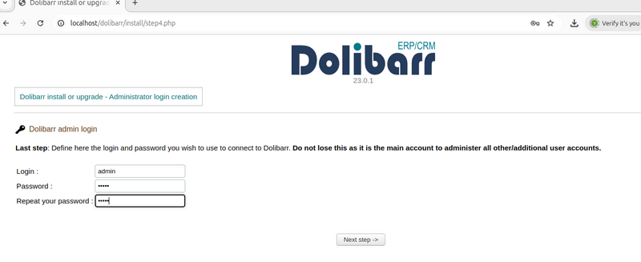

Now the Dolibar is ready for using in the cyber range. We need to fill in some staff information and enable the function modules such as the HRM system and the leaving system so it can be fix the role of a ERP system in a railway company.


------

### 4. Configure the Dolibarr Function Models

This section is more related to add the information and enable the function modules of the Dolibarr ERP & CRM system used in the railway company via the admin dashboard. For detailed usage guidance, you may refer to the official documentation and tutorials:

- https://wiki.dolibarr.org/index.php/User_documentation
- https://www.dolibarr.org/dolibarr-tutorial-videos.php

Log in using the **admin account** created in the previous section to access the setup dashboard. The main function I configured is shown in the below diagram:

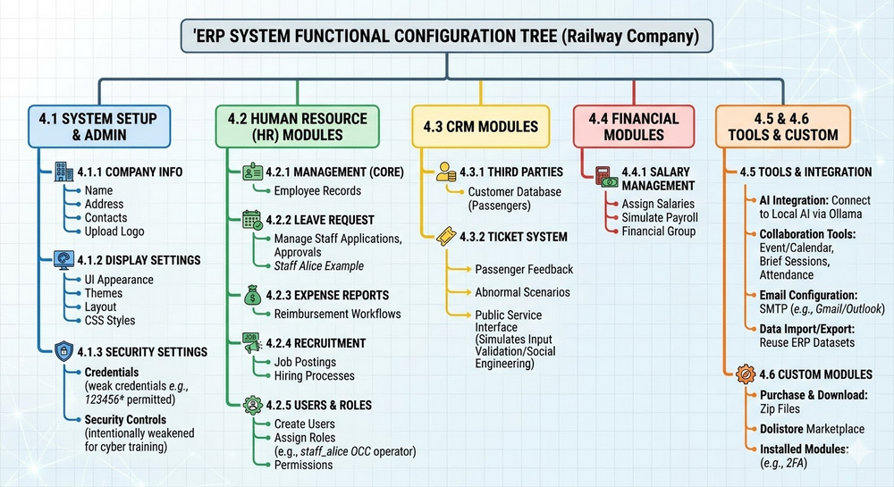

#### 4.1 Configure Company Information

Navigate to **Setup → Company/Organization** then fill in essential information such as railway company name, address and contact details, Official email and website, phone and fax and upload company logo as shown below:

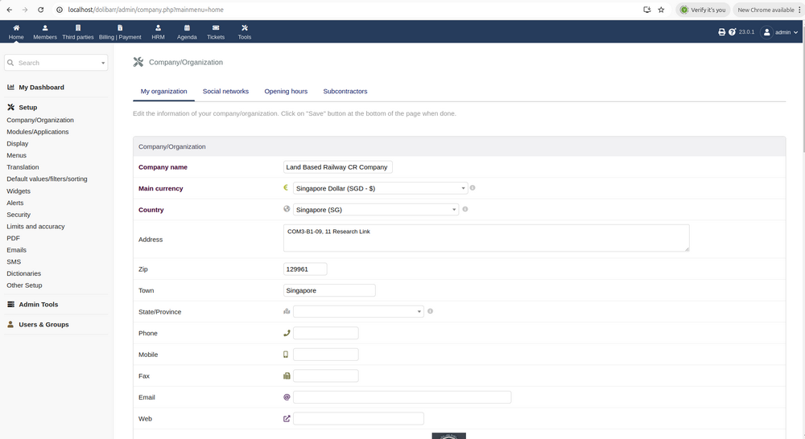

Next, Go to **Display settings** to adjust the UI appearance customize themes, layout, and CSS styles as shown below:

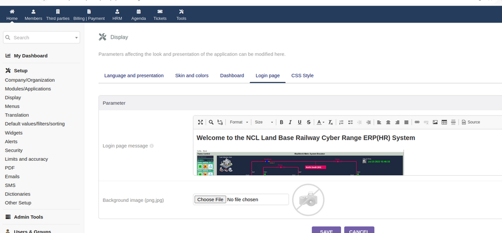

For cybersecurity training and exercise purposes, you may intentionally weaken certain security controls by navigate to **Security Settings** as shown below:

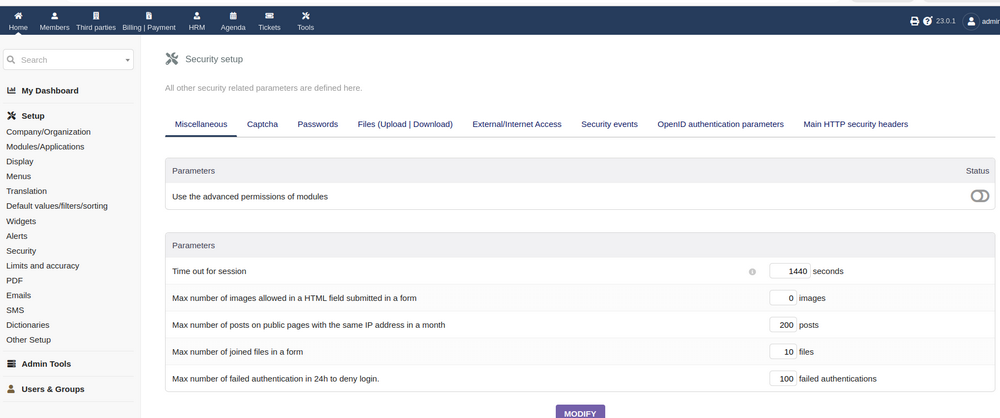

This allows the use of weak credentials (e.g., `123456`), which can later serve as **attack entry points** during exercises.

After setup the company Information then the main portal login page will be like this with the company name and logo and overview image:

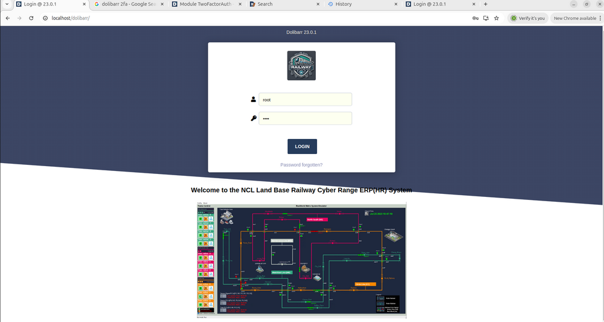

#### 4.2 Configure Human Resource (HR) Modules

Navigate to **Setup → Modules/Applications** to active the below modules: 

- **Leave Request Management** – manage staff leave applications and approvals
- **Expense Reports** – simulate reimbursement workflows
- **Recruitment** – manage job postings and hiring processes
- **Human Resource Management** – core employee management tools

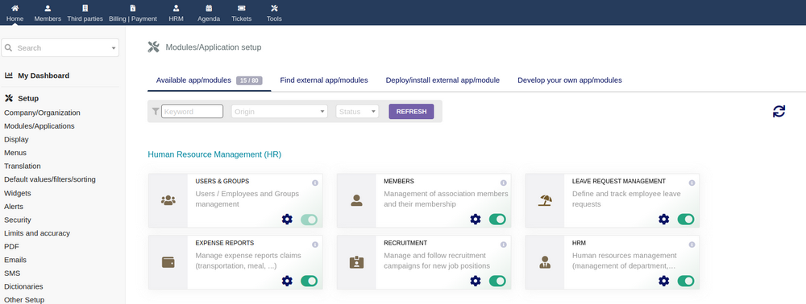

Next, create users and assign roles for the staff's accounts (e.g., `staff_alice` as an OCC operator) and assign permissions based on job roles as shown below:

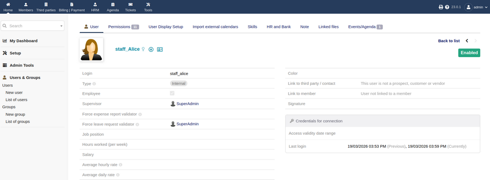

Now we login Alice account and simulate her submit a leave request and set approval for the management group:

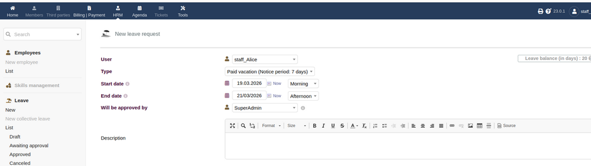

Then log back in as admin/manager to review and approve Alice's leave request we created just now:

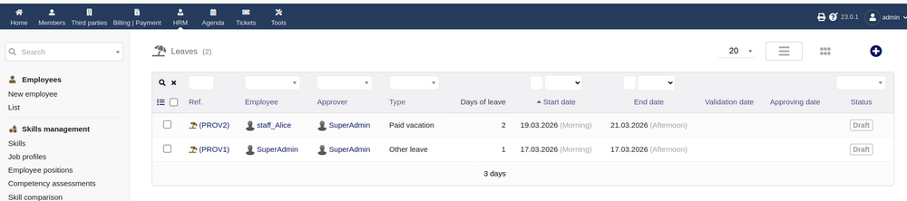

#### 4.3 Configure Customer Relationship Management (CRM)

To simulate passenger interaction and service feedback, enable CRM-related modules Third Parties (Customers) and Ticket System for customer to report the abnormal scenario of feed back the service as shown below:

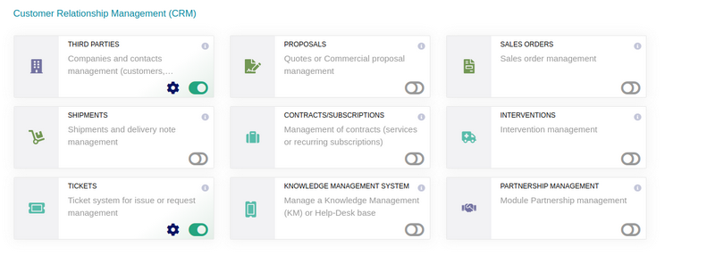

In the ticket system, we need to configure the public service interface so the passengers can use it as shown below:

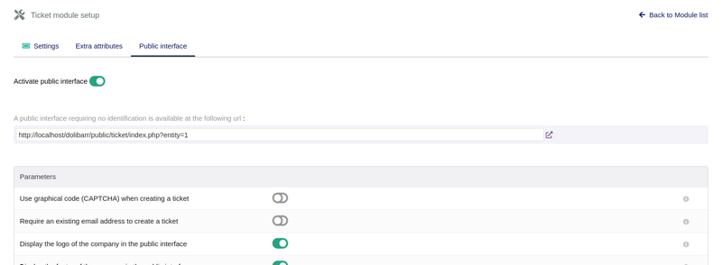

After that the passengers can access the ticket system page as shown below:

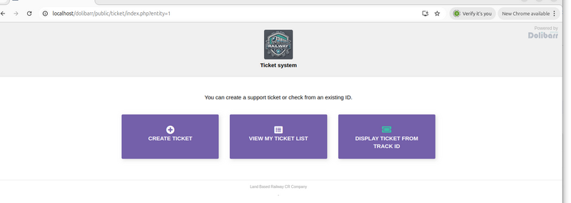

This module is particularly useful for simulating the external attack surfaces, Input validation vulnerabilities and Social engineering scenarios. 

#### 4.4 Configure Financial Modules

For simulation purposes, only essential financial features are required. I enabled the Salary Management section:

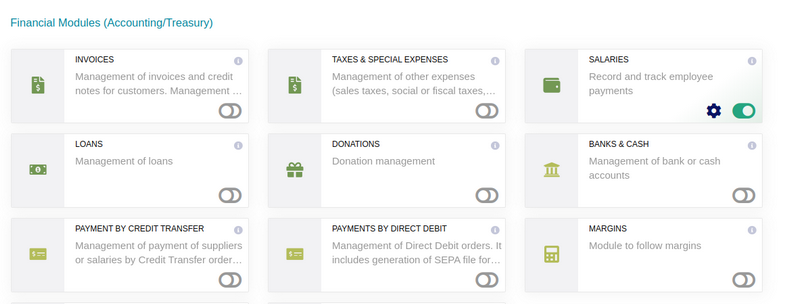

After that we can login the the admin or user under financial group to assign salaries to staff and simulate payroll as shown below:

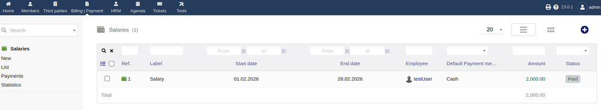

#### 4.5 Configure Multi-Module Tools and Integration

To improve scalability and realism, enable supporting tools:

- **Data Import/Export** : Allows reuse of ERP datasets across multiple cyber range deployments
- **AI Integration**: Connect to local AI services (e.g., via Ollama)
- **Email Configuration** : Configure SMTP using services like Gmail or Outlook https://wiki.dolibarr.org/index.php/Setup_EMails. 
- **Collaboration Tools** : Enable event/calendar module

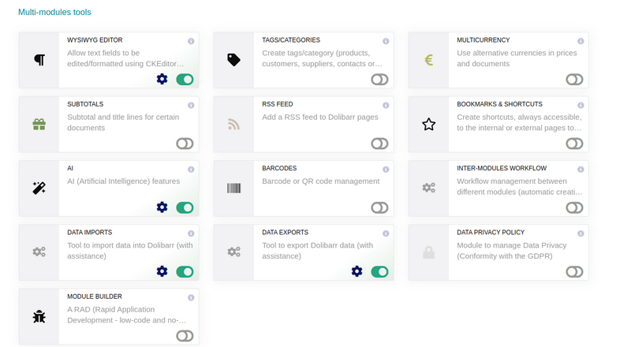

To enable AI with custom AI service provided then we can link the function to the local GPU with Ollama service. 

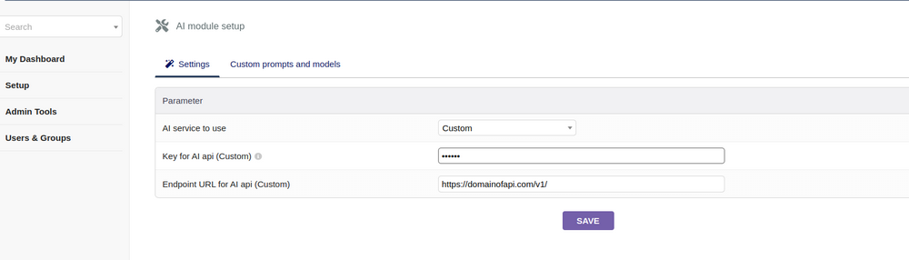

For the collaborative work I only active the event collaboration as show below: 

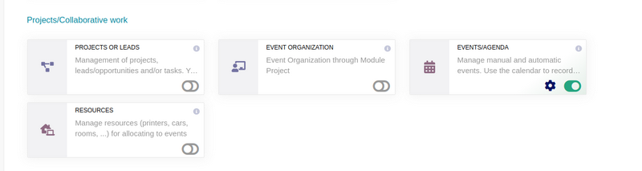

Then as admin we can create a event such as a brief session and assign the attendance for different railway staff by add them in the calendar event:

 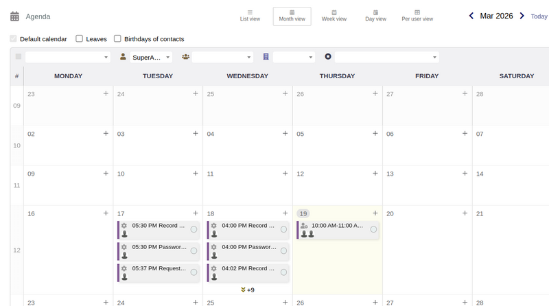

Now we almost have all the modules we need for a simple railway company, then the next step is to fill in the staff information, we can use AI to generate the staff information. To use the python script to generate a action in the ERP system such as apply leave in the HR system, we need to use the lib https://pypi.org/project/dolibarr/

```python
 from dolibarr import Dolibarr
 api_url = '<nowiki>http://your-url/dolibarr/htdocs/api/index.php/'</nowiki>
 api_key = 'custom_API-Key'

 # Connection to dolibarr
 dolibarr_inst = Dolibarr(api_url, api_key)
```

Then we follow the example in this link https://wiki.dolibarr.org/index.php/Module_Web_Services_API_REST_(developer)#PHP to call the related API to generate the event or action. 


#### 4.6 Configure Advanced / Custom Modules

For extended functionality (e.g., **Two-Factor Authentication (2FA)**), you need to purchase the additional modules then download the zip file and installed from the Dolibarr marketplace: https://www.dolistore.com/index.php?l=en. 

Purchase and download the required module and Install following: https://wiki.dolibarr.org/index.php/Module_TwoFactorAuth

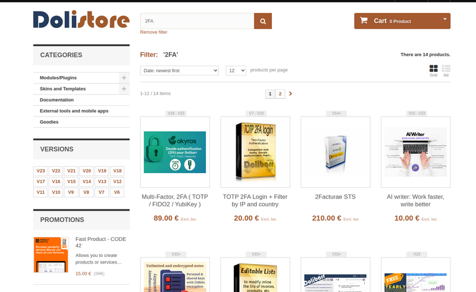

After this stage, the ERP system is fully configured to simulate a railway company’s enterprise IT environment. It includes:

- Realistic organizational structure and user roles
- HR, CRM, and financial workflows
- External interaction interfaces
- Automation and AI-generated data

This completes the ERP setup for the cyber range, transforming it into a **dynamic, interactive, and attackable IT environment** suitable for advanced cybersecurity exercises.


------

>  last edit by LiuYuancheng (liu_yuan_cheng@hotmail.com) by 20/03/2026 if you have any problem, please send me a message. 