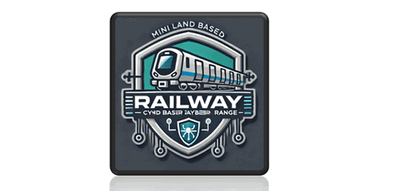
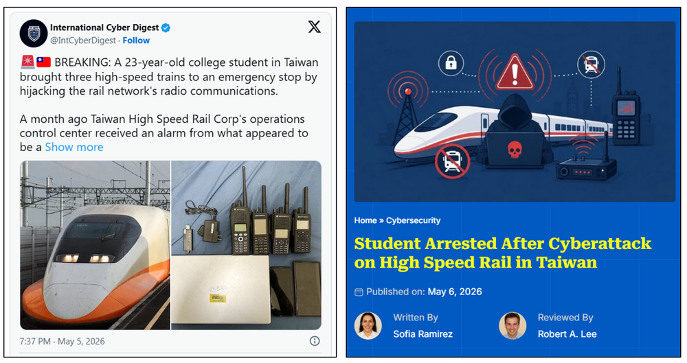
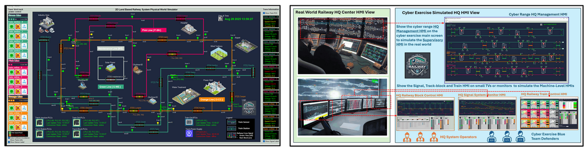
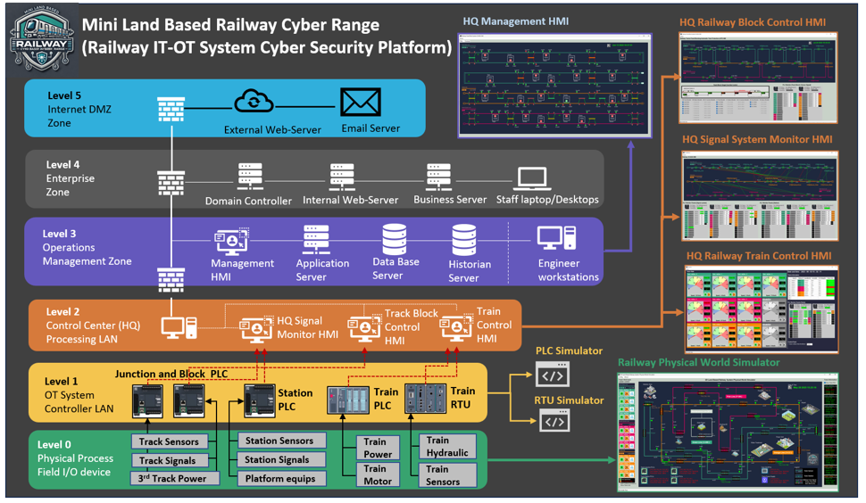
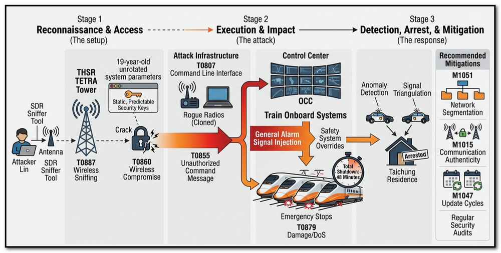

## High Speed Rail Spoofing Attack Case Study : False Data Injection Attack on Railway Cyber Twin

**Project Background and Design Purpose** : 

The idea for this case study was inspired by the report “**Taiwan High Speed Rail Hit by Spoofing Attack That Stops Three Trains**” released on 06 May 2026, which described a cybersecurity incident targeting the Taiwan railway’s Operational Technology (OT) and communication infrastructure. According to the report, three high-speed rail trains were unexpectedly forced into emergency stop conditions, resulting in approximately 48 minutes of service disruption across major transit operations. Preliminary investigation indicated that the incident was related to a signal spoofing attack affecting the railway communication and control system.



In this case study, the Land-Based Railway OT Simulation Cyber Twin I developed is used to simulate a similar cybersecurity scenario in a controlled cyber range environment. The objective is not to create a one-to-one replication of the real-world incident, but to demonstrate how a False Data Injection (FDI) and spoofing attack could impact railway OT operations, train signaling logic, and automated safety mechanisms within a software-defined railway cyber twin platform.

The article is organized into the following sections:

- A brief summary of the reported spoofing attack incident involving the Taiwan High Speed Rail system.
- An introduction to the simulated railway radio communication system implemented in the Land-Based Railway Cyber Twin platform.
- The design methodology used to replicate a similar spoofing attack scenario within the cyber range environment.
- A detailed demonstration of the False Data Injection (FDI) spoofing attack, including the attack process, operational impact, and incident progression during the cyber exercise.
- Discussion of possible detection methods, defensive mechanisms, and incident response strategies against this category of railway OT cyberattack.

Although this case study is implemented entirely within a software-based cyber range platform, it demonstrates how realistic railway OT attack scenarios can be reproduced safely for cybersecurity research and training purposes. The study also illustrates how OT cyber twins can help railway cybersecurity teams better understand attack behaviors, evaluate operational impact, and improve incident response readiness during cyber exercises.

```python
# Author:      Yuancheng Liu
# Created:     2026/05/06
# Version:     v_0.0.1
# Copyright:   Copyright (c) 2026 LiuYuancheng
# License:     MIT License
```

**Table of Contents**

[TOC]

------

### 1. Introduction

A cyberattack on Taiwan’s high speed rail network forced multiple trains into emergency stops after a university student allegedly hacked into the railway’s radio communication system in  April 2026. This case study project will replicate the cyber attack scenario on OT level by focus on demonstrating the attack workflow, vulnerability exploitation process, operational impact, attack path, and related technologies used in the simulation environment (Land-Based Railway OT Simulation Cyber Twin). The study also highlights how OT cyber ranges can support cybersecurity training, incident response exercises, attack analysis, and defensive capability validation for railway operators and security teams.

#### 1.1 Summary of the Cyber Attack and Accident 



A 23-year-old university student and radio enthusiast, identified by the surname Lin, was arrested for a sophisticated "spoofing" attack on the Taiwan High Speed Rail (THSR) system during the Qingming Festival holiday in April 2026.  

**1.1.1 Key Details of the Incident**

- **The Attack:** Using consumer-grade **Software-Defined Radio (SDR)** equipment and tools purchased online, Lin analyzed the THSR’s radio signals. He managed to crack the system's parameters and "cloned" a legitimate beacon signal to send a high-priority **"General Alarm"** message to the control center.  
- **The Impact:** The false alarm triggered safety protocols on **April 5, 2026, at 11:23 PM**, forcing three trains into immediate manual emergency stops. A fourth train was halted shortly after. The incident caused a total disruption of **48 minutes**, delaying hundreds of passengers returning from the holiday.  
- **The Vulnerability:** Experts revealed that the student exploited weaknesses in the **TETRA radio system**, which THSR had used for 19 years without rotating its security parameters. Lin reportedly cracked multiple layers of verification mechanisms to send the unauthorized signal.  
- **The Arrest:** Police traced the signal to Lin’s residence in Taichung, where they seized 11 handheld radios, an SDR receiver, and a laptop. He was released on NT$100,000 bail and faces charges for endangering public safety and interfering with transportation.  

**1.1.2 incident Aftermath**

The incident has sparked a national security debate in Taiwan regarding the vulnerability of critical infrastructure to "pranks" or attacks using inexpensive, widely available hardware. The Ministry of Transportation has since ordered a comprehensive security review and hardening of communication systems for all rail and metro operators.  

**1.1.3 Reference Link** 

- https://gbhackers.com/taiwan-high-speed-rail-hit-by-spoofing-attack/
- https://sqmagazine.co.uk/taiwan-student-high-speed-rail-cyberattack/


#### 1.2 Introduction of Land-Based Railway Cyber Twin platform



As shown in the Summary of the Cyber Attack and Accident, the cyber attack will aim to the train control center (OCC) by focusing on cloned a radio report data and send the message to trigger an alarm. I will use the  Land-Based Railway Cyber Twin platform to simulate the attack scenario. 

The Land Based Railway Simulation Cyber Twin System is a fully digital distributed cyber security platform software to simulate all SIX different levels OT and IT environment of a railway system. It provides the simulation modules from pure railway OT system such as the physical track signaling systems, railway ATC and ATP system and station control system with the real OT protocols. The Cyber Twin's ISA-95/IEC-62264 Architecture is shown below:



The Cyber range has been used in several international cyber exercise and professional training for more detail please refer to below document: 

- https://github.com/LiuYuancheng/Land_Based_Railway_Simulation_Cyber_Range_Document
- [Use PLC to Implement Land Based Railway Track Fixed Block Signaling OT System](https://www.linkedin.com/pulse/use-plc-implement-land-based-railway-track-fixed-block-yuancheng-liu-saaec)
- [Simulating Simple Railway Station Train Dock and Depart Auto-Control System with IEC104 PLC Simulator](https://www.linkedin.com/pulse/simulating-simple-railway-station-train-dock-depart-auto-control-liu-vsscc)
- [Implementing Different Human-Machine Interfaces (HMI) for a Land-Based Railway Cyber Range](https://www.linkedin.com/pulse/implementing-different-human-machine-interfaces-hmi-land-based-liu-cqojc)
- [Design and Usage of the Human-Machine Interfaces (HMI) for a Land-Based Railway Cyber Range](https://www.linkedin.com/pulse/design-usage-human-machine-interfaces-hmi-land-based-railway-liu-idpfc)

- [Design of the Train Control for Land-Based Railway Cyber Range](https://www.linkedin.com/pulse/design-train-control-land-based-railway-cyber-range-yuancheng-liu-alusc)

- [Fast Way to Setup an ERP(IT) System For the  Land Based Railway System Cyber Range](https://www.linkedin.com/pulse/fast-way-setup-erpit-system-critical-infra-cyber-range-yuancheng-liu-psykc)


------

### 2. Spoofing Attack Analysis

#### 2.1 Attack MITRE ATT&CK framework mapping

This section will use the MITRE ATT&CK for ICS (Industrial Control Systems) framework to the analysis spoofing attack on the Taiwan High Speed Rail (THSR) in April 2026 and also show which actions will also be applied or implement on the  Land Based Railway Simulation Cyber Twin System. 

This attack is a classic example of **wireless exploitation** leading to **process disruption**. Below is the mapping of the attacker's steps to the relevant ATT&CK ICS tactics and techniques: 



| **Tactic**                 | **Technique ID** | **Technique Name**                         | **Attack Detail**                                            | Apply  on Cyber Twin |
| -------------------------- | ---------------- | ------------------------------------------ | ------------------------------------------------------------ | -------------------- |
| **Reconnaissance**         | **T0887**        | **Wireless Sniffing**                      | Lin used a Software-Defined Radio (SDR) filter to intercept and analyze TETRA radio signals. | Yes                  |
| **Initial Access**         | **T0860**        | **Wireless Compromise**                    | Exploited the unencrypted or weakly secured TETRA radio frequencies used by THSR for 19 years. | Yes                  |
| **Execution**              | **T0807**        | **Command-Line Interface**                 | Used a laptop and SDR software tools to decode parameters and program handheld radios. | Yes                  |
| **Persistence**            | **T0859**        | **Valid Accounts / Parameters**            | Bypassed 7 layers of verification by using legitimate (cloned) system parameters and beacons. | No                   |
| **Evasion**                | **T0849**        | **Masquerading**                           | Programmed handheld radios to "impersonate" legitimate THSR beacons to avoid rejection by the control center. | Yes                  |
| **Impair Process Control** | **T0855**        | **Unauthorized Command Message**           | Transmitted a high-priority "General Alarm" signal to the control center and trains. | Yes                  |
| **Impact**                 | **T0879**        | **Damage to Property / Denial of Service** | Forced emergency braking on 4 trains, causing a 48-minute total operational shutdown. | Yes                  |

#### 2.2 Replicated Attack Outline on Cyber Twin

The key vector for the signal spoofing is inject false alarm data to the control center, so in our case study, we will also simulate the radio data injection from un-authorization device to the railway signal antenna. As the cyber range using network to simulate the wireless and radio link so the protocol we will attack will be the siemens-S7comm which can be used for OT device communication via network, 5G and radio link. So the case study will show the 

- S7comm radio signals analysis and data unencrypt
- Generate the False data and transmit to the railway data collection antenna
- Inject Unauthorized force data in the OT controller (RTU) and impact the OCC 
- Trigger the OCC operational safe mechanism and cased the train emergency stop. 

**2.2.1 Introduction of False Data Injection (FDI):**

- **Objective:** The main goal of FDI is to manipulate the data within the OT system, leading to incorrect or misleading information being processed by the control systems.
- **Method:** Attackers inject false or manipulated data into the sensors or communication channels within the OT system. This can lead to the control systems making incorrect decisions based on the compromised data.
- **Example:** In a power grid, an FDI attack might involve injecting false sensor readings that indicate lower electricity demand than actual. This could lead to incorrect decisions in adjusting power generation levels, potentially causing disruptions or even damage to the system.


------

### 3 Design of Radio Communication System in Cyber Twin