## High Speed Rail Spoofing Cyber Attack Case Study : Use Cyber Twin to Simulate the Cyber Incident Happened in Taiwan High Speed Rail 

**Project Background and Design Purpose** : 

The idea for this case study was inspired by the report “**Taiwan High Speed Rail Hit by Spoofing Attack That Stops Three Trains**” released on 06 May 2026, which described a cybersecurity incident targeting the Taiwan railway’s Operational Technology (OT) and communication infrastructure. According to the report, three high-speed rail trains were unexpectedly forced into emergency stop conditions, resulting in approximately 48 minutes of service disruption across major transit operations. Preliminary investigation indicated that the incident was related to a signal spoofing attack affecting the railway communication and control system.


In this case study, the Land-Based Railway OT Simulation Cyber Twin I developed is used to simulate a similar cybersecurity scenario in a controlled cyber range environment. The objective is not to create a one-to-one replication of the real-world incident, but to demonstrate how a False Data Injection (FDI) and spoofing attack could impact railway OT operations, train signaling logic, and automated safety mechanisms within a software-defined railway cyber twin platform.

The article is organized into the following sections:

- A brief summary of the reported spoofing attack incident involving the Taiwan High Speed Rail system.
- An introduction to the simulated railway radio communication system implemented in the Land-Based Railway Cyber Twin platform.
- The design methodology used to replicate a similar spoofing attack scenario within the cyber range environment.
- A detailed demonstration of the False Data Injection (FDI) spoofing attack, including the attack process, operational impact, and incident progression during the cyber exercise.
- Discussion of possible detection methods, defensive mechanisms, and incident response strategies against this category of railway OT cyberattack.

Although this case study is implemented entirely within a software-based cyber range platform, it demonstrates how realistic railway OT attack scenarios can be reproduced safely for cybersecurity research and training purposes. The study also illustrates how OT cyber twins can help railway cybersecurity teams better understand attack behaviors, evaluate operational impact, and improve incident response readiness during cyber exercises.

```python
# Author:      Yuancheng Liu
# Created:     2026/05/06
# Version:     v_0.0.1
# Copyright:   Copyright (c) 2026 LiuYuancheng
# License:     MIT License
```

**Table of Contents**

[TOC]

------

### 1. Introduction

In April 2026, Taiwan’s high-speed railway system experienced a significant cybersecurity incident when multiple trains were forced into emergency stop conditions after a spoofing attack targeted the railway radio communication network. According to public reports, the attack was allegedly conducted by a 23 years old university student using low-cost Software-Defined Radio (SDR) equipment to analyze and inject unauthorized wireless communication signals into the railway operational system. The incident demonstrated how modern railway infrastructure can be affected by cyberattacks targeting Operational Technology (OT) communication systems and highlighted the growing cybersecurity risks faced by critical transportation infrastructure.

This case study project aims to replicate/simulate a similar cyberattack scenario within the controlled OT cyber range platform **Land-Based Railway OT Simulation Cyber Twin**. The objective of the project is not to reproduce the real-world incident exactly, but to demonstrate the possible attack workflow, vulnerability exploitation process, operational impact, attack path, and related technologies involved in a railway False Data Injection (FDI) and spoofing attack scenario. The project also demonstrates how railway OT cyber ranges can be used for cybersecurity research, professional training, incident response exercises, attack analysis, and defensive capability validation for railway operators and cybersecurity teams.


#### 1.1 Summary of the Cyber Attack and Incident

A 23-year-old university student and radio enthusiast, identified by the surname Lin, was arrested for allegedly conducting a sophisticated spoofing attack against the Taiwan High Speed Rail (THSR) system during the Qingming Festival holiday period in April 2026: 


**1.1.1 Key Details of the Incident**

- **The Attack:** Using consumer-grade **Software-Defined Radio (SDR)** equipment and tools purchased online, Lin analyzed the THSR’s radio signals. He managed to crack the system's parameters and "cloned" a legitimate beacon signal to send a high-priority **"General Alarm"** message to the control center.  
- **The Impact:** The false alarm triggered safety protocols on **April 5, 2026, at 11:23 PM**, forcing three trains into immediate manual emergency stops. A fourth train was halted shortly after. The incident caused a total disruption of **48 minutes**, delaying hundreds of passengers returning from the holiday.  
- **The Vulnerability:** Experts revealed that the student exploited weaknesses in the **TETRA radio system**, which THSR had used for 19 years without rotating its security parameters. Lin reportedly cracked multiple layers of verification mechanisms to send the unauthorized signal.  
- **The Arrest:** Police traced the signal to Lin’s residence in Taichung, where they seized 11 handheld radios, an SDR receiver, and a laptop. He was released on NT$100,000 bail and faces charges for endangering public safety and interfering with transportation.  

**1.1.2 incident Aftermath**

The incident triggered significant public and governmental concern regarding the cybersecurity resilience of critical transportation infrastructure against low-cost and widely accessible attack technologies. Following the event, Taiwan transportation authorities initiated comprehensive reviews of railway and metro communication systems, focusing on improving authentication mechanisms, encryption, parameter management, and wireless communication security hardening.

This event also highlighted how cyberattacks targeting OT communication systems can directly affect railway operational safety, train scheduling, passenger services, and emergency response procedures.

**1.1.3 Reference Link** 

- https://gbhackers.com/taiwan-high-speed-rail-hit-by-spoofing-attack/
- https://sqmagazine.co.uk/taiwan-student-high-speed-rail-cyberattack/
- https://www.taipeitimes.com/News/taiwan/archives/2026/05/05/2003856781


#### 1.2 Introduction to the Land-Based Railway Cyber Twin Platform

As described in the incident summary, the spoofing attack primarily targeted the railway train control communication process by cloning legitimate radio communication data and injecting false alarm messages into the operational environment. To demonstrate this type of cyberattack safely, the **Land-Based Railway Cyber Twin** platform is used to simulate the railway OT environment and replicate the attack scenario. The system interface overview is shown below:


**1.2.1 Cyber Twin System architecture** 

The **Land-Based Railway Simulation Cyber Twin System** is a fully software-based distributed cybersecurity simulation platform designed to emulate all six ISA-95/IEC-62264 IT and OT layers of a modern railway system. The platform includes simulation modules for multiple railway operational subsystems, including:

- Railway track fixed-block signaling systems
- Railway 3rd Track Power System
- Automatic Train Control (ATC) systems
- Automatic Train Protection (ATP) systems
- Railway Radio Communication System
- Railway station control systems
- Train dispatch and operational control center (OCC) systems
- Human-Machine Interface (HMI) monitoring systems
- Industrial communication protocols and field device simulations

The ISA-95 / IEC-62264 system architecture implementation of the railway cyber twin platform is shown below:


**1.2.2 Detailed System Introduction Document**

The railway cyber range has been used in multiple international cybersecurity exercises, professional training programs, and OT security research projects. Additional project details and related technical references are available in the following documents:

- https://github.com/LiuYuancheng/Land_Based_Railway_Simulation_Cyber_Range_Document
- [Use PLC to Implement Land Based Railway Track Fixed Block Signaling OT System](https://www.linkedin.com/pulse/use-plc-implement-land-based-railway-track-fixed-block-yuancheng-liu-saaec)
- [Simulating Simple Railway Station Train Dock and Depart Auto-Control System with IEC104 PLC Simulator](https://www.linkedin.com/pulse/simulating-simple-railway-station-train-dock-depart-auto-control-liu-vsscc)
- [Implementing Different Human-Machine Interfaces (HMI) for a Land-Based Railway Cyber Range](https://www.linkedin.com/pulse/implementing-different-human-machine-interfaces-hmi-land-based-liu-cqojc)
- [Design and Usage of the Human-Machine Interfaces (HMI) for a Land-Based Railway Cyber Range](https://www.linkedin.com/pulse/design-usage-human-machine-interfaces-hmi-land-based-railway-liu-idpfc)

- [Design of the Train Control for Land-Based Railway Cyber Range](https://www.linkedin.com/pulse/design-train-control-land-based-railway-cyber-range-yuancheng-liu-alusc)

- [Fast Way to Setup an ERP(IT) System For the  Land Based Railway System Cyber Range](https://www.linkedin.com/pulse/fast-way-setup-erpit-system-critical-infra-cyber-range-yuancheng-liu-psykc)


------

### 2. Spoofing Attack Analysis

This section analyzes the Taiwan High Speed Rail (THSR) spoofing attack using the MITRE ATT&CK for ICS (Industrial Control Systems) framework and explains how a similar attack scenario can be replicated within the Land-Based Railway Simulation Cyber Twin System. The objective includes:

- Understand the attacker’s workflow, identify the related ICS attack techniques. 
- Demonstrate how False Data Injection (FDI) and signal spoofing attacks can affect railway Operational Technology (OT) environments.

#### 2.1 MITRE ATT&CK for ICS Framework Mapping

This section maps the reported THSR spoofing attack to the MITRE ATT&CK for ICS framework and identifies which attack techniques are implemented in the cyber twin simulation environment.

The attack workflow consists of several stages, including wireless reconnaissance, communication exploitation, signal impersonation, false data injection, and operational disruption. The mapping diagram is shown below:


| **Tactic**                 | **Technique ID** | **Technique Name**                         | **Attack Detail**                                            | Apply  on Cyber Twin |
| -------------------------- | ---------------- | ------------------------------------------ | ------------------------------------------------------------ | -------------------- |
| **Reconnaissance**         | **T0887**        | **Wireless Sniffing**                      | Lin used a Software-Defined Radio (SDR) filter to intercept and analyze TETRA radio signals. | Yes                  |
| **Initial Access**         | **T0860**        | **Wireless Compromise**                    | Exploited the unencrypted or weakly secured TETRA radio frequencies used by THSR for 19 years. | Yes                  |
| **Execution**              | **T0807**        | **Command-Line Interface**                 | Used a laptop and SDR software tools to decode parameters and program handheld radios. | Yes                  |
| **Persistence**            | **T0859**        | **Valid Accounts / Parameters**            | Bypassed 7 layers of verification by using legitimate (cloned) system parameters and beacons. | No                   |
| **Evasion**                | **T0849**        | **Masquerading**                           | Programmed handheld radios to "impersonate" legitimate THSR beacons to avoid rejection by the control center. | Yes                  |
| **Impair Process Control** | **T0855**        | **Unauthorized Command Message**           | Transmitted a high-priority "General Alarm" signal to the control center and trains. | Yes                  |
| **Impact**                 | **T0879**        | **Damage to Property / Denial of Service** | Forced emergency braking on 4 trains, causing a 48-minute total operational shutdown. | Yes                  |

Within the cyber twin environment, most of the attack stages can be replicated safely using simulated OT communication protocols, virtual RTUs, and software-defined signaling systems.


#### 2.2 Replicated Attack Outline on Cyber Twin

The primary attack vector in the reported spoofing incident was the injection of unauthorized alarm data into the railway communication system. Therefore, this case study focuses on simulating a similar False Data Injection (FDI) attack within the railway cyber twin platform. 

In the real-world incident, the attacker targeted wireless radio communication infrastructure using spoofed beacon signals. In the cyber range environment, the wireless and radio communication links are simulated using industrial OT communication protocols over IP networks. The protocol selected for this case study is **Siemens S7comm**, which is commonly used for industrial communication between PLCs, RTUs, SCADA systems, and distributed OT devices over Ethernet, wireless bridges, and industrial radio links.

The replicated attack workflow consists of the following stages:

- **Signal Analysis** : S7Comm radio signals analysis and data decryption.
- **Parameter Cracking and Packet Construction** : Decode train data parameters and generate the false data packet. 
- **False Data Injection**: Transmit unauthorized false operational packet to train data collection RTU via radio antenna. 
- **Operational Impact on OCC** : Trigger abnormal operational states within the OCC and activate emergency protection logic. 
- **Safety Mechanism Activation** : Demonstrate how the railway protection system responds to abnormal cased service disruption. 

#### 2.3 Introduction of False Data Injection (FDI) Attack

False Data Injection (FDI) is a cyberattack technique in which attackers intentionally inject manipulated or forged data into an Operational Technology (OT) system to influence system behavior, operational decisions, or automated control logic.

- **Objective:** The main goal of FDI is to manipulate the data within the OT system, leading to incorrect or misleading information being processed by the control systems.
- **Method:** Attackers inject false or manipulated data into the sensors or communication channels within the OT system. This can lead to the control systems making incorrect decisions based on the compromised data.
- **Example:** In a power grid, an FDI attack might involve injecting false sensor readings that indicate lower electricity demand than actual. This could lead to incorrect decisions in adjusting power generation levels, potentially causing disruptions or even damage to the system.


------

### 3. Design of Radio Communication and Train Power System in Cyber Twin

Before introducing the attack workflow and technologies used in this case study, it is important to first explain the design of the affected subsystems within the railway cyber twin platform. This helps illustrate which components are vulnerable to the spoofing and False Data Injection (FDI) attack and how the attack can propagate through the railway Operational Technology (OT) environment.

The cyberattack scenario in this study primarily impacts two critical railway OT subsystems:

- The **Railway Third-Track Power Supply System**, which is responsible for supplying electrical power to trains and supporting emergency stop operations.
- The **Railway Radio Communication System**, which is responsible for transmitting operational train telemetry and status data between field devices and the Operational Control Center (OCC).

The workflow and relationship between these two subsystems are shown in the diagram below:

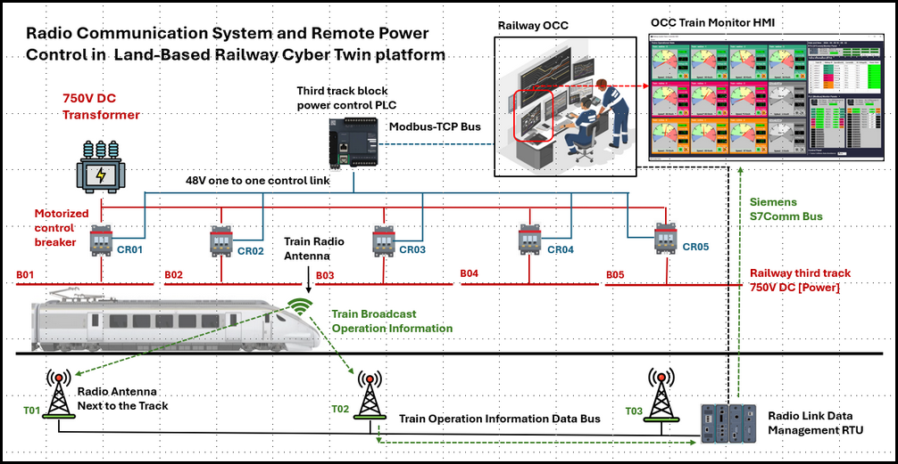

In the simulation environment, the radio communication system acts as the primary attack target, while the train power control system becomes the impacted operational subsystem that causes the visible service disruption during the cyberattack exercise.

#### 3.1 Design of Railway Third-Track Power System

As shown in the system architecture diagram, the railway trains receive electrical power through a simulated 750V DC third-track power system, which is implemented in the cyber twin according to the general concepts of the `EN-50155 railway electronic system standard`. The main components and design includes:

- The third track is divided into multiple continuous power blocks along the railway track sections labeled as `B01`, `B02`, `B03` ... ,  as the train moves along the track, it connects to these power blocks sequentially to receive electrical power. 
- Each power block is connected to the main 750V DC transformer through a dedicated motorized control breaker or controllable relay module, represented as `CR01`, `CR02`, `CR03` ... These breakers simulate the real-world railway power isolation and protection mechanisms. 
- Each controllable relay is connected to the output coils of the **Third-Track Block Power Control PLC**, allowing the PLC to remotely switch the power supply for each track section ON or OFF.
- The Third-Track Power Control PLC communicates with the Railway Operational Control Center (OCC) through the Modbus-TCP industrial communication protocol. Through the OCC Train Monitor Human-Machine Interface (HMI), operators can remotely monitor and control the power state of each railway track block.

During emergency stop operations, the OCC operator can issue remote braking commands to the train. If the train does not respond correctly or continues moving abnormally, the operator can forcibly isolate the power supply by remotely opening the corresponding third-track breaker.


#### 3.2 Design of Railway Radio Communication System

The railway radio communication system is the primary target subsystem of the spoofing attack demonstrated in this case study.

As shown in the architecture diagram, each simulated train contains a virtual wireless communication module and train broadcast antenna responsible for transmitting real-time operational telemetry information to track-side communication towers. The transmitted operational information includes : `Current train speed`, `Average train speed`, `Brake air pressure`, `Input power voltage`, `Motor current`, `Train motor RPM`, `Radar status` `Timestamp` and `Other train operational telemetry data`.  

In the cyber twin platform, the communication data transmission follows a simulated **Siemens S7 Message Structure (Protocol Data Unit - PDU)** format to emulate industrial OT communication behavior commonly used in railway and industrial control environments.

The main components and design includes:

- Along the railway track, multiple simulated radio receiver towers are deployed at fixed distances to receive operational telemetry data from nearby trains. 
- Each track-side radio receiver tower forwards the collected operational data to the **Radio Link Data Management RTU (Remote Terminal Unit)**. The RTU aggregates telemetry data from multiple trains and then transmits the operational information to the Railway OCC using the **Siemens S7comm industrial communication protocol**.
- At the OCC level, the received telemetry information is processed and visualized through the **OCC Train Monitor HMI Dashboard**, where railway operators can observe real-time train operational status and system alarms.

Because the OCC relies on the integrity and authenticity of this communication data to make operational decisions, the railway radio communication subsystem becomes a critical attack surface for spoofing and False Data Injection (FDI) attacks.


#### 3.3 Design of OCC Train Emergency Stop Function

To ensure operational safety within the railway cyber twin platform, the Operational Control Center (OCC) includes an automatic emergency stop protection mechanism designed to detect abnormal train speed conditions and automatically trigger railway safety responses. The workflow of the simulated OCC Train Automatic Emergency Stop Mechanism is shown in the diagram below:

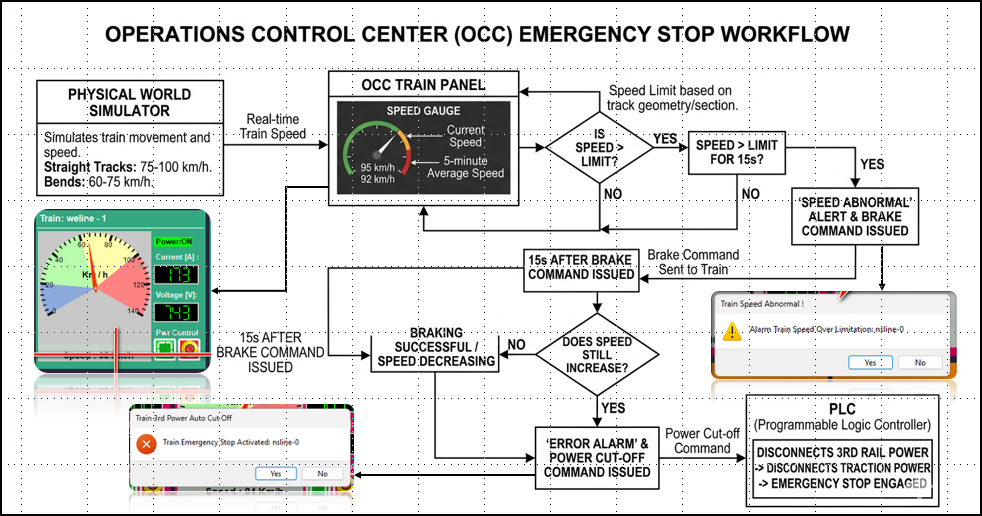

the physical world simulator continuously emulates train movement and operational behavior with train speeds ranging from **0 km/h to 100 km/h**. The train speed profile changes dynamically based on the simulated railway track conditions:

- When the train is operating on a **straight track section**, the normal operational speed range is between **75 km/h and 100 km/h**.
- When the train enters a **curved or bend track section**, the train speed is automatically reduced to a safer range between **60 km/h and 75 km/h**.

The simulated train acceleration and deceleration behavior is implemented using linear speed transitions to emulate realistic railway operational characteristics.

The emergency stop logic is implemented as a multi-stage railway safety protection mechanism.

- **Stage 1 – Overspeed Detection** : When the OCC detects that a train is operating above the predefined speed limitation for more than **15 seconds**, the system generates an **Abnormal Speed Warning Alert** on the OCC dashboard. At the same time, the OCC automatically transmits a remote braking command to the train control subsystem requesting the train to reduce its speed.
- **Stage 2 – Automatic Brake Verification** : After the braking command is issued, the OCC continues monitoring the train telemetry data received from the railway communication system. If the train speed remains abnormal or continues increasing during the next **15 seconds**, the OCC interprets the situation as a critical operational safety violation. At this stage, the Train Control HMI escalates the warning state into a **Critical Emergency Alarm** condition.
- **Stage 3 – Emergency Power Isolation** : Once the critical alarm condition is triggered, the OCC automatically sends a remote command to the **Third-Track Power Control PLC** to disconnect the power supply of the affected railway block section.

The PLC then opens the corresponding motorized control breaker connected to the third-track power system, immediately isolating the **750V DC power supply** from the train. Without traction power, the train is forced into an emergency stop condition.

In this cyberattack case study, the attacker’s objective is to intentionally trigger the automatic emergency stop mechanism by injecting spoofed operational telemetry and false train speed data into the railway communication system.


------

### 4. Attack Scenario and Demo on Cyber Twin

This section introduces the simulated spoofing attack scenario implemented on the Land-Based Railway OT Simulation Cyber Twin platform and demonstrates how a False Data Injection (FDI) attack can trigger railway emergency protection mechanisms and disrupt train operations.

#### 4.1 Simulated Attack Scenario and Attack Path on Cyber Twin

The objective of the attack simulation is to reproduce a communication-layer spoofing attack similar to the Taiwan High Speed Rail (THSR) incident by targeting the railway radio communication infrastructure and injecting forged train operational telemetry into the Operational Control Center (OCC). The overall attack workflow implemented in the cyber twin environment is shown below:

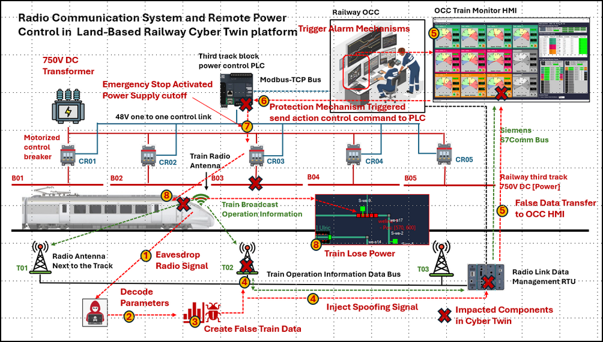

The spoofing attack simulation consists of eight sequential stages: 

- **Step-T1: Eavesdrop Railway Radio Signals** : The attacker first creates a simulated radio receiver program to collect communication traffic between the train and the railway radio antenna system.
- **Step-T2: Decode S7 Communication Parameters** : After collecting the traffic data, the attacker analyzes the captured packets to identify the industrial communication protocol structure and operational parameters.
- **Step-T3: Create False Train Operational Data** : Using the decoded protocol structure and telemetry format, the attacker constructs forged S7 communication packets containing manipulated malicious operational payload (falsified train overspeed condition). 
- **Step-T4: Inject Spoofed Communication Signals** : Transmit the forged S7 telemetry packets to the Radio Link Management RTU through the simulated radio antenna communication channel.
- **Step-T5: False Data Transfer to OCC HMI** : The OCC Train Monitoring HMI retrieves the false speed data from the RTU through the Siemens S7comm communication protocol.
- **Step-T6: Trigger Railway Alarm Mechanisms** : Once the falsified train speed exceeds the configured operational limit for a predefined duration, the OCC automatically activates the railway protection logic then sends automatic braking commands to the train.
- **Step-T7: Emergency Stop Protection Activation** : After the braking command fails to reduce the reported train speed, the OCC interprets the situation as a critical train operational fault. The OCC then issues a remote command to the Third-Track Power Control PLC to disconnect the power supply. 
- **Step-T8: Train Emergency Stop** : Once the third-track power supply is disconnected, the train immediately loses traction power and enters the emergency stop state.


#### 4.2 Cyber Attack Demonstration on Railway Cyber Twin

The railway cyber twin platform used in this case study consists of 21OT virtual machines (VMs) distributed across multiple OT Green Team and Blue team network segments.

The simulated attack steps and targeted devices are illustrated in the cyber twin network topology below and the attack path is highlighted in the diagram using the numbered red workflow arrows.

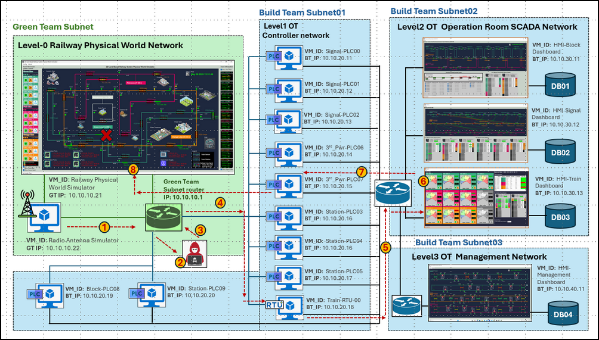


**4.2.1 Eavesdrop Radio Signal** 

To simulate physical-world wireless signal interception, the attacker VM is deployed within the Green Team subnet, I use the TCPDump to simulate the radio receiving to capture communication traffic exchanged between the train and antenna. The TCPDump recording script used in the simulation is shown below:

```bash
#!/bin/bash
now=$(date +'%Y%m%d')
dumpfile="/home/router_admin/tcpdump/"$now"Tcpdump.pcap"
nohup tcpdump -i any -w $dumpfile -C 500 -K -n -B 20000 &
```

The packet capture process is executed on the Green Team router to simulate passive radio communication monitoring and the captured traffic is stored as PCAP files for later analysis.


**4.2.2 Decode S7 Message Parameters**

After capturing the communication traffic, the attacker analyzes the PCAP files using Wireshark to identify the industrial communication protocol and operational data structure. Because the attacker already knows that the target communication uses simulated Siemens S7 communication messages, the traffic is filtered using the **ISO 8073 / X.224 COTP** protocol filter: 

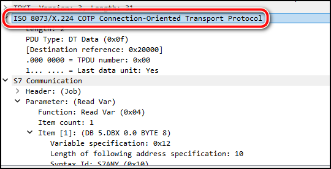

From the captured communication stream, the attacker identifies the message length, transmission structure, and telemetry payload format as shown below:

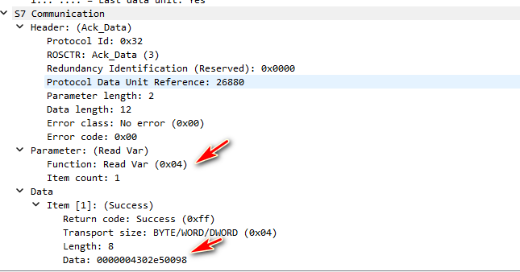

Initially, the operational meaning of the telemetry data is unknown and hard to be identified by the hacker. Then  in the real incident as the THSR device was not updated for 19 years, here we make an assumption that there are already some signaling sequence information leaked to the public. 

The attacker identifies a frequently transmitted 8-byte when train pass by him and decoded the data:

```yaml
S7 Communication
    Header: (Ack_Data)
        Protocol Id: 0x32
        ROSCTR: Ack_Data (3)
        Redundancy Identification (Reserved): 0x0000
        Protocol Data Unit Reference: 38400
        Parameter length: 2
        Data length: 12
        Error class: No error (0x00)
        Error code: 0x00
    Parameter: (Read Var)
        Function: Read Var (0x04)
        Item count: 1
    Data
        Item [1]: (Success)
            Return code: Success (0xff)
            Transport size: BYTE/WORD/DWORD (0x04)
            Length: 8
            Data: 0000006402ec0096
```

The 8 bytes data sequence is : Train's Front Sensor Trigger State(2Bytes Bool), Train Speed (2Bytes Int), Train Motor Voltage [V] (2Bytes Int), Train Operate Current [A] (2Bytes Int). For example in the Packet Example, data `0000006402ec0096` can be decode : 

- `0000` : Front Sensor is not triggered, not detect front train in alert distance 
- `0064`: Train current speed 100km/h 
- `02ec`: Train motor input voltage is 750 V -DC 
- `0096`: Train motor operation current is 150 A


**4.2.3 Create False Train Speed Data and Inject to Antenna**

As shown in the network topology, the radio antenna simulator VM's IP address is `10.10.10.21`, the attacker then develops a spoofing script that continuously transmits forged high-speed telemetry data to overwrite the legitimate train operational data. The attacker also identifies that the train index value maps directly to the RTU data block index and selects: `Train ID = 00005` as the target.(As he find that the train Index is mapping to the same data block index of the RTU)

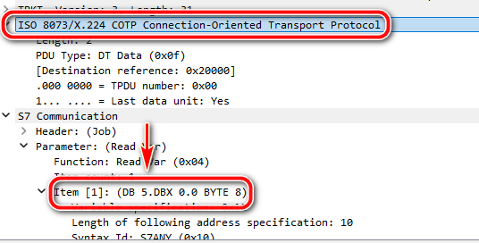

To build the sender, the attacker use the S7Comm lib develop in the RTU simulator project:  https://github.com/LiuYuancheng/PLC_and_RTU_Simulator/tree/main/S7Comm_RTU_Simulator, a example sender program is shown below:

```python
import os
import time
print("Current working directory is : %s" % os.getcwd())
DIR_PATH = dirpath = os.path.dirname(os.path.abspath(__file__))
print("Current source code location : [%s]" % dirpath)
#-----------------------------------------------------------------------------
print("Test import S7Comm lib: ")
try:
    import snap7Comm
    from snap7Comm import BOOL_TYPE, INT_TYPE, REAL_TYPE
except ImportError as err:
    print("Import error: %s" % str(err))
    exit()
print("- pass")
#-----------------------------------------------------------------------------
# Import dll file for windows platform.
libpath = os.path.join(dirpath, 'snap7.dll')
print("Import snap7 dll path: %s" % str(libpath))
if os.path.exists(libpath):
    print("- pass")
else:
    print("Error: not file the dll file.")
    exit()
#-----------------------------------------------------------------------------
# Test cases:
RTU_ANTENNA_IP= '10.10.10.22' # change this IP to the Power grid RTU02 IP address
RADIO_FREQUEnCY = 102 # use the opened port as the radio frequency.
client = snap7Comm.s7CommClient(RTU_ANTENNA_IP, rtuPort=RADIO_FREQUEnCY, snapLibPath=libpath)
connection = client.checkConn()
initSpeed = 75
trainIdx = 5
if connection:
    for i in range(50):
        initSpeed += 10 # increase speed to avoid the false data filter activate.
        print("Attack: Start inject out of range speed value = %s km to the train RTU " %str(initSpeed))
        client.setAddressVal(trainIdx, 2, initSpeed, dataType=INT_TYPE)
        time.sleep(0.2)
        print("Inject Done !")
```


**4.2.4 Inject Spoofing Signal and Transfer False Data to OCC**

After finalizing the spoofing script and selecting Train 00005 as the target, the attacker waits until the train enters the communication coverage area of the radio antenna.

When the train registers with the antenna system, the attacker begins transmitting the forged telemetry packets at high frequency. As the attack progresses, the OCC Train Monitoring HMI displays abnormal speed values, and the speed gauge becomes locked within the red danger zone. The OCC Train HMI View is shown below:

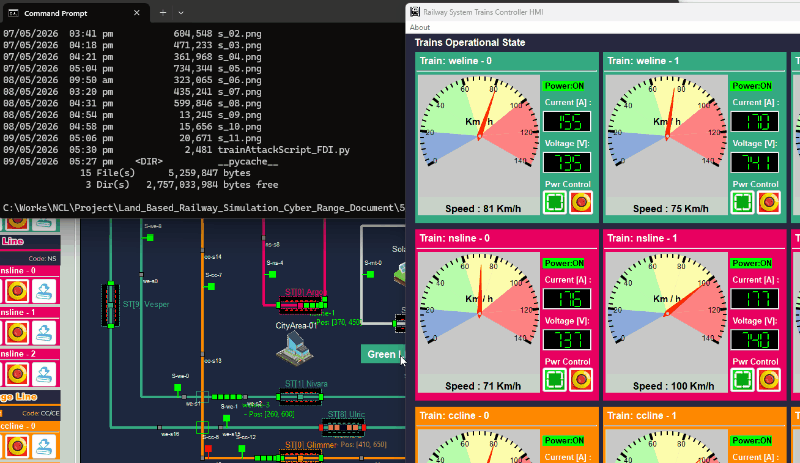

The manipulated speed values continuously increase until they exceed 200 km/h, despite the physical train simulator continuing to operate normally (56 km/h) as shown below:

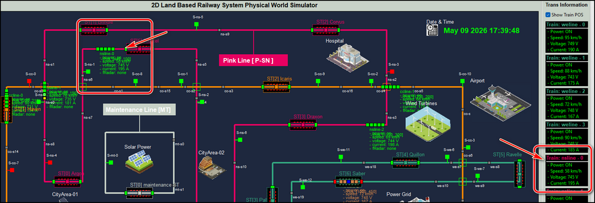


**4.2.5 Trigger Alarm Mechanisms and Train Emergency Stop Activated**

Once the forged train speed exceeds the configured safety threshold for more than 15 seconds, the OCC automatically generates a train overspeed alarm and pop-up a dialog as shown below:

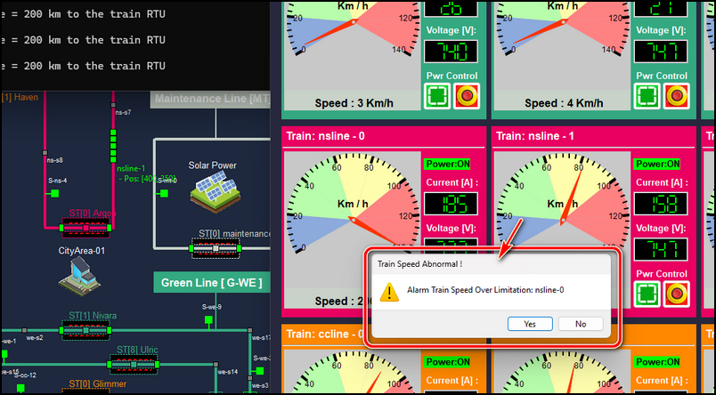

At the same time, the OCC begins transmitting remote braking commands to Train 00005 to reduce the reported speed.

However, because the attacker continuously injects falsified telemetry data, the OCC determines that the train braking system is malfunctioning or unresponsive. After an additional 15 seconds, the OCC automatically activates the emergency protection mechanism. 

The emergency stop activated alarm dialog pop-up and the train 00005(ns-0) 's power will be cut off as show below:

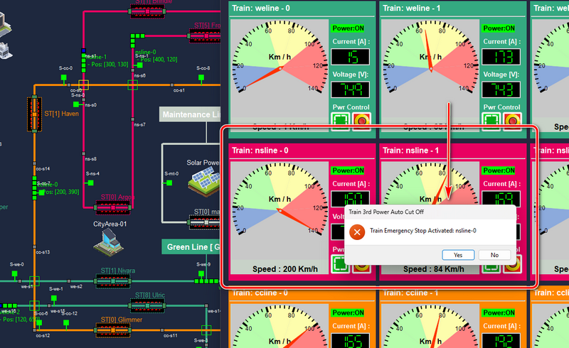

The emergency stop alarm is triggered, and the OCC sends a remote command to disconnect the third-track power supply for the affected railway block. Approximately one second later, the train enters the emergency stop state within the physical world simulator, indicated by the flashing red and grey train status as shown below:

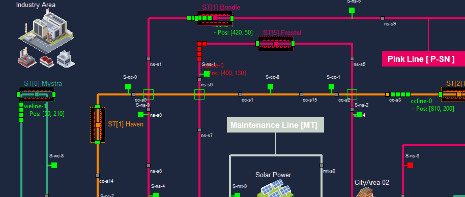

After 18mins, the emergency stop condition also impacts additional trains operating behind the affected train. As a result, multiple trains are forced to brake and stop, causing cascading railway service disruption along the pink railway line.

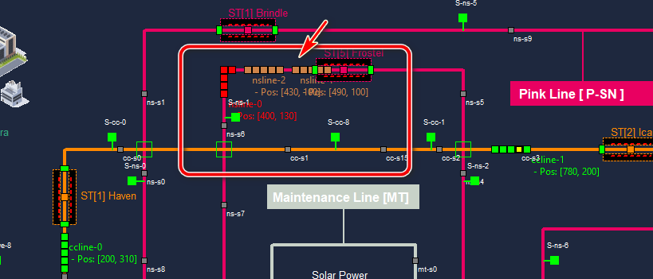

Now we simulated the entire process of the cyber incidence scenario happened in Taiwan High Speed Rail. To recover, the tower operator need to reset the RTU speed and off the impacted antenna's power then turn on the 3rd track block to make the 3 trains recover operational. 


------

### 5. Possible Attack Detection and Defensive Mechanisms

The spoofing attack demonstrated in this case study shows how railway Operational Technology (OT) systems can be affected by False Data Injection (FDI) attacks targeting the communication trust relationship between field devices, radio communication infrastructure, RTUs, and the Operational Control Center (OCC).

#### 5.1 Possible Detection Mechanisms

Several monitoring and anomaly detection techniques can help identify spoofing or FDI attacks targeting railway communication systems:

- **Communication Traffic Behavior-Based Anomaly Detection** :
- **Operational Logic Validation:** Validate train operational telemetry against physical railway constraints.
- **Cross-Sensor Data Correlation:** Compare train operational data collected from multiple independent sources 
- **Industrial Intrusion Detection Systems (IDS):** Deploy OT-aware IDS solutions capable of monitoring industrial protocols. 
- **Wireless Spectrum Monitoring:** Continuously monitor railway radio frequency bands to detect unauthorized transmissions.

#### 5.2 Possible Defensive Mechanisms

To improve the cybersecurity resilience of railway OT systems against spoofing attacks, several defensive strategies can be implemented:

- **Strong Authentication for OT Communication:** Implement mutual authentication and digital signature validation.
- **Communication Encryption:** Protect railway communication traffic using modern encryption protocols 
- **Regular Security Parameter Rotation:** Frequently rotate wireless communication keys and identifiers to reduce long-term exposure. 
- **Protocol Security Hardening:** Add integrity verification, replay protection, and packet sequence validation mechanisms. 

#### 5.3 Incident Response Actions

In the event of a suspected railway OT spoofing attack, rapid incident response is critical to minimize operational disruption and maintain passenger safety. The response actions includes : 

- Isolate suspicious communication channels or radio towers from the operational network.
- Switch affected railway systems into manual or degraded operational modes.
- Validate train telemetry using independent operational monitoring systems.
- Preserve network traffic logs and PCAP data for forensic investigation.
- Block unauthorized communication sources and rogue radio devices.
- Coordinate incident response between railway operators, OT engineers, cybersecurity teams, and transportation authorities.
- Conduct post-incident analysis and update detection signatures, communication policies, and operational procedures.


------

> last edit by LiuYuancheng (liu_yuan_cheng@hotmail.com) by 09/0/2026 if you have any problem, please send me a message. 